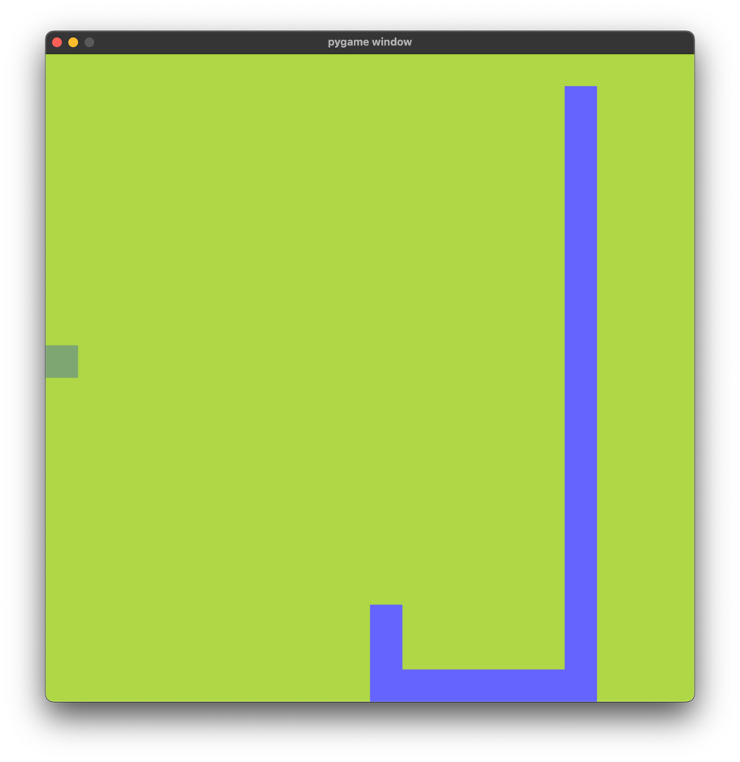

# Learning Python with Pygame

Here I am trying to learn Python. The idea is that I use concepts from
[Dead Simple Python](https://nostarch.com/dead-simple-python) while learning
[Pygame](https://www.pygame.org) by watching [Youtube](https://www.youtube.com/watch?v=AY9MnQ4x3zk)
and making a game.

This project is just a simple playground that I want to be the base for some games I'll make.
The idea is simple:

- Make simple games
- Use good modern Python standards e.g.:
    * using [Poetry](https://python-poetry.org) to manage dependencies and virtual env
    * using [Black](https://github.com/psf/black), [iSort](https://pycqa.github.io/isort/)
      and [Pyright](https://github.com/microsoft/pyright) to make the code look and feel conformant
- structure my code properly with folders, `___init___.py`
- try and figure out list comprehensions and advanced python syntax
- try and use

Currently I have implemented a simple version of the snake game



## Requirements

* Python 3.11
* [Poetry](https://python-poetry.org)

## Running the project

__Install dependencies__

```shell
poetry install
```

__Run the project__

```shell
poetry shell
python game_playground/game.py
```